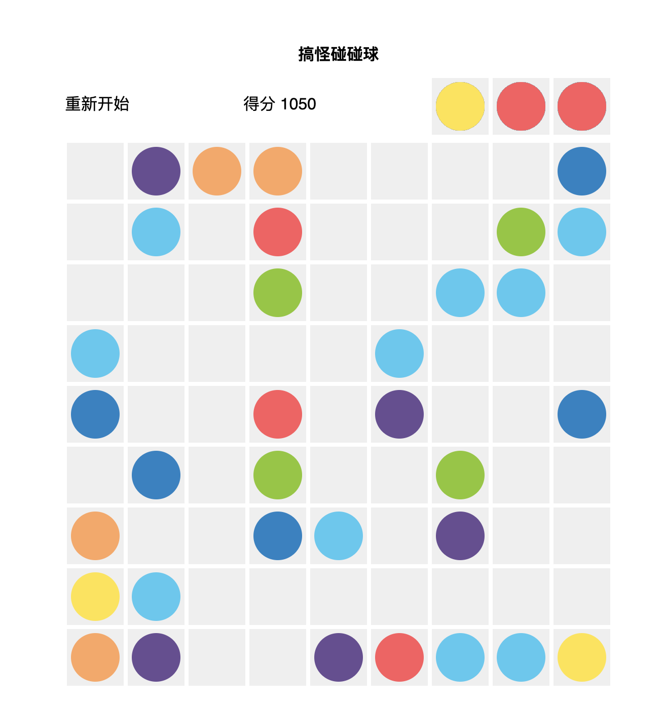

# Ball-Lines
搞怪碰碰球
a game for my mum

rules:
- click and move balls to form a line - horizontal, vertical or diagonal
- lines with 5+ balls will be cancelled and points will be earned
- white ball can be replaced by any color ball when being cancelled
- three random will be added in each round
- if no more space to add balls, game will stop
